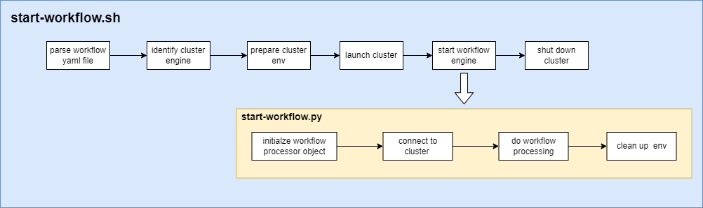

# Distributed Classical ML Workflow
Learn to use Intel's CPU hardware and Intel optimized software for distributed data preprocessing and model training using Modin, Spark and Ray. Boost your productivity in building an end-to-end machine learning pipeline to solve classical machine learning tasks such as regression and classification with XGBoost.

Check out more workflow examples in the [Developer Catalog](https://developer.intel.com/aireferenceimplementations).


## Overview
This repository contains an end-to-end workflow that lets you quickly set up a distributed machine learning pipeline using XGBoost. It originates from Intel's democratization solution for the [ACM RecSys-2021 challenge](http://www.recsyschallenge.com/2021/) and is designed for a wide range of classical ML tasks such as regression or classification on large-scale tabular dataset. The top 3 benefits users would get from this workflow are:

- quickly set-up a machine learning pipeline using the workflow configuration files
    
    Thanks to the config-file driven design, you can quickly build an end-to-end machine learning pipeline without writing a single line of code. All you need to do is define the workflow configuration files (see examples in `application/fraud_detection/workflow-config.yaml`) and start the workflow with one command: `./start-workflow.sh <path of workflow-config.yaml>` 

- low-effort in scaling your existing single-node machine learning pipeline to a cluster

    The workflow encapsulates the underlying computing environment and infrastructure for users who want to go from single-node to multi-node for their existing machine learning pipeline. All you need to do is define the computation environment in the workflow configuration files.  
 
- performance gain through Intel optimized software

    Check out the fraud detection example of the workflow and see a significant performance boost when using Modin to do distributed data processing, when compared to Pandas. 


## Hardware Requirements
Here's the supported hardware to run this workflow: 
| **Name**:                | **Description**
| :---                              | :---
| CPU                               | Intel® Xeon® Platinum 8380 CPU @ 2.30GHz (160 vCPUs)
| Free RAM                          | 460 GB/503 GB
| Disk Size                         | 1.5 TB
| Network Speed                     | ~300MB/s


## How it Works
To understand the workflow, we'll explain what the `start-workflow.sh` and `start-workflow.py` scripts do. The image below gives a good overview:



1. When you run `./start-workflow.sh workflow-config.yaml`, parameters defined in the yaml file are first parsed in the `start-workflow.sh` bash script.
2. Based on the data preprocessing framework and the model training framework defined in the config file, the underlying cluster engine (either Spark or Ray) is identified. 
3. Then, based on the required number of nodes, temporary workflow folders are prepared on all cluster nodes and all cluster machines communicate with each other via ssh. 
4. The corresponding cluster is launched and the `start-workflow.py` gets executed. In the `start-workflow.py`, an object called `WFProcessor` is initialized. This object is the abstraction of the whole workflow and only takes the path of `workflow-config.yaml` as the input argument.
5. The workflow extracts the information defined in the configuration files and does all the processing work based on the blueprint.
6. When the workflow finishes processing, the cluster is shut down so that the cluster resource is released. 


## Get Started
### Download the Workflow Repository
Create a working directory for the workflow and clone the [Main
Repository](https://github.com/intel/recommender-system-with-classical-ml.git) into your working
directory.

```
mkdir ~/work && cd ~/work
git clone https://github.com/intel/recommender-system-with-classical-ml.git
cd recommender-system-with-classical-ml
```

### Download the Datasets
You can try out the workflow by first downloading the synthetic credit card transaction dataset from [IBM/tabformer](https://github.com/IBM/TabFormer/blob/main/data/credit_card/transactions.tgz). Each row in the data corresponds to a credit card transaction and each transaction includes features such as card id, merchant id, amount of the transaction and transaction date. 

We recommend you put the data files in one folder under a dataset parent folder as shown below.
This `<datasets parent folder>` must be the same as `DATA_PATH` defined in the `workflow-config.yaml`.

```bash 
cd <datasets parent folder>
mkdir <workflow dataset folder>
cd <workflow dataset folder>
<download datasets using wget, curl, rsync, etc. to dataset folder>
```


## Run Using Docker
Follow these instructions to set up and run using Docker. For running on bare metal, see the [bare metal installation](docs/bare-metal-installation.md) document. 
   

### Set Up Docker Engine
You'll need to install Docker Engine on your development system.
Note that while **Docker Engine** is free to use, **Docker Desktop** may require
you to purchase a license.  See the [Docker Engine Server installation
instructions](https://docs.docker.com/engine/install/#server) for details.

### Set Up Docker Image
Use the following command to build the workflow Docker image:
```bash
./scripts/build-image.sh 
```
If you want to do distributed data processing or training, you will need to ensure that each node on your cluster shares the same Docker image. After building the image successfully, use the following commands to copy the Docker image to the worker nodes:  
```bash
# save docker image 
docker save -o wf-image.tar classical-ml-wf:latest
# copy over to worker node 
scp wf-image.tar <worker node hostname>:<path on the worker node>
## go to the worker node 
ssh <worker node hostname>
cd <path on the worker node>
## unpack the docker image 
docker load -i wf-image.tar
```
Furthermore, you will need to ensure the password-less ssh between your cluster nodes. Otherwise, you would need to manually enter the password every time data folder transportation happens between the cluster nodes. For password-less ssh, check out this [post](http://www.drugdesign.gr/blog/how-to-setup-passwordless-ssh-access-between-nodes-in-a-cluster).


### Run Docker Image
The workflow provides a collection of well-written bash scripts to make it easy for you to use the workflow. All you need to do is define your own workflow configuration files. Examples of the workflow configuration files can be found under the folder `application/fraud_detection`. Once the configuration files are defined, use the following command to start the workflow:
```bash
./start-workflow.sh application/fraud_detection/workflow-config.yaml
```

## Expected Output
If the workflow executes successfully, you should see the message `shut down cluster...` and the cluster node names, e.g. `hadoop-master` and `hadoop-slave1`  at the end of the command line output. 

## Summary and Next Steps
We have shown what this workflow does and how it works in a high-level overview. Furthermore, we have shown how to use this workflow to do single-node or distributed data processing and XGBoost training using the configuration files in the fraud detection example. As next steps, try using your own dataset as input for the workflow and building your own machine learning pipeline with the workflow.  

## Learn More
For more information about this workflow or to read about other relevant workflow
examples, see these guides and software resources:

- [Credit Card Fraud Detection Reference Use Case](https://github.com/oneapi-src/credit-card-fraud-detection)
- [Graph Neural Networks and Analytics](https://github.com/intel/graph-neural-networks-and-analytics)


## Troubleshooting
Potential issues and workarounds related to Hadoop and Spark can be found in [Hadoop Traps & Pitfalls](docs/hadoop-traps-pitfalls.md) and [Spark Traps & Pitfalls](docs/spark-traps-pitfalls.md). For other issues, please submit [GitHub
issues](https://github.com/intel-sandbox/applications.ai.appliedml.workflow.analyticswithpython/issues). 


## Support
The Distributed Classical ML Workflow team tracks both bugs and
enhancement requests using [GitHub
issues](https://github.com/intel/recommender-system-with-classical-ml/issues).
Before submitting a suggestion or bug report, search the existing issues first to
see if your issue has already been reported.