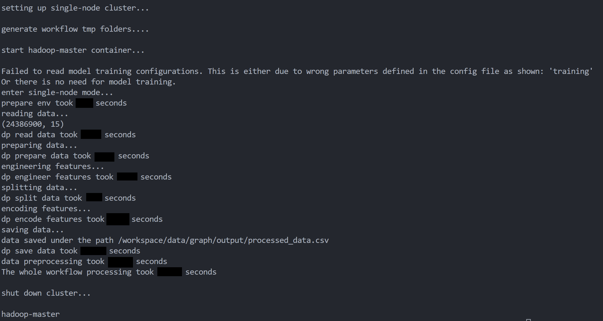

# Distributed Classical ML Workflow
Learn to use Intel's CPU hardware and Intel optimized software for distributed data preprocessing and model training using Modin, Spark and Ray. Boost your productivity in building an end-to-end machine learning pipeline to solve classical machine learning tasks such as regression and classification with XGBoost.

This workflow is used by the [Credit Card Fraud Detection Reference Use Case](https://github.com/oneapi-src/credit-card-fraud-detection).

Check out more workflow examples in the [Developer Catalog](https://developer.intel.com/aireferenceimplementations).


## Overview
This repository contains an end-to-end workflow that lets you quickly set up a distributed machine learning pipeline using XGBoost. It originates from Intel's democratization solution for the [ACM RecSys-2021 challenge](http://www.recsyschallenge.com/2021/) and is designed for a wide range of classical ML tasks such as regression or classification on large-scale tabular dataset. The top 3 benefits users would get from this workflow are:

- **quickly set-up a machine learning pipeline using the workflow configuration files**
    
    Thanks to the config-file driven design, you can quickly build an end-to-end machine learning pipeline without writing a single line of code. All you need to do is define the workflow configuration files (see examples in `application/fraud_detection/workflow-config.yaml`) and start the workflow with one command: `./start-workflow.sh <path of workflow-config.yaml>` 

- **low-effort in scaling your existing single-node machine learning pipeline to a cluster**

    The workflow encapsulates the underlying computing environment and infrastructure for users who want to go from single-node to multi-node for their existing machine learning pipeline. All you need to do is define the computation environment in the workflow configuration files.  
 
- **performance gain through Intel optimized software**

    Check out the fraud detection example of the workflow in the `applications/fraud_detection` folder and see a significant performance boost when using Modin to do distributed data processing, when compared to Pandas. 


Distributed classical ML workflow supports both **config-driven** and **script-driven** execution mode:
- **Config-driven** is the low code mode and targets to build a full engineering-agnostic data science UX. In config-driven model, users only need to config through configuration yaml files for data preprocessing and model training, then the workflow will take care of all the other things;
- 
- **Script-driven** means that users still need to write their own python scripts for data preprocessing and model training, but users can save a lot of time by utilizing the existing workflow APIs 

For both cases, users don't need to take care of the environment set-up work. Users just need to specify their env requirement in the workflow-config.yaml and the workflow will take care of the env set-up, both for single-node and multi-node 

Distributed classical workflow comes with 2 applications by default:
- **Fraud detection** is the application for demonstrating the config-driven execution mode of the workflow; it is a full pandas-based ML application
- **RecSys2021** is the application for demonstrating the script-driven execution mode of the workflow; it is a full spark-based ML application 

## Hardware Requirements

The recommended hardware to run this workflow is 
|**Recommended Hardware**	|**Precision**
| :---                              | :---
|Intel® 1st, 2nd, 3rd, and 4th Gen Xeon® Scalable Performance processors|	FP32


This workflow has been tested on the following hardware using Ubuntu 20.04 as the operating system:
| **Name**:                | **Description**
| :---                              | :---
| CPU                               | Intel® Xeon® Platinum 8380 CPU @ 2.30GHz (160 vCPUs)
| Free RAM                          | 460 GB/503 GB
| Disk Size                         | 1.5 TB
| Network Speed                     | ~300MB/s


## How it Works
To understand the workflow, we'll explain what the `run-workflow.sh` scripts does behind the scene. The image below gives a good overview and the different color in the image indicates different bash script:


1. When you run `./run-workflow.sh workflow-config.yaml`, parameters defined in the yaml file are first parsed in the `run-workflow.sh` bash script.
2. From the parameters, the computing environment is identified, e.g. single-node or distributed, what is the underlying cluster engine (either Spark or Ray) etc.
3. Then, temporary workflow folders are prepared on all cluster nodes and all cluster machines communicate with each other via ssh. 
4. Later, the workflow containers are launched with `launch-wf-containers.sh` and the cluster is started with `launch-cluster-engine.sh`. 
5. The actual computation happens in the start workflow step, where the `start-workflow.py` gets executed. In the `start-workflow.py`, an object called `WFProcessor` is initialized. This object is the abstraction of the whole workflow, which takes the path of `workflow-config.yaml` and the mode as the input argument.
5. The workflow extracts the information defined in the configuration files and does all the processing work based on the blueprint.
6. When the workflow finishes processing, the cluster is shut down so that the cluster resource is released. 


Please note that for the spark-based cluster engine users need to enter the workflow containers and manually start the workflow scripts. The workflow containers wouldn't be shut down automatically. 

### About the configuration files
The workflow configuration files consist of 3 different yaml files: 
- the [`workflow-config.yaml`](applications/fraud_detection/workflow-config.yaml), where you specify the computational environment and the runtime configurations. You need to ensure that your `workflow-config.yaml` includes `env` and one of the `data_preprocess`, `training` and `end2end_training` sections. 
- the [`data-preprocessing.yaml`](applications/fraud_detection/data-preprocessing.yaml), where you define the detailed data transformation steps in a sequential order. We categorize data transformation operations into 3 groups: `pre-splitting transformation`, `data splitting`, `post-splitting transformation`. Pre-splitting transformations are those operations before data splitting. Data splitting divides data into train and test sets. Post-splitting transformations are those you need to provide train and test data sets, e.g. target encoding. 
- the [`model-training.yaml`](applications/fraud_detection/model-training.yaml), where you need to provide details about the training configurations. It consists of `data_spec` and one of `hpo_spec` and `model_spec`.

Depending on your need, you may need either `data-preprocessing.yaml` or `model-training.yaml` or both of them. For more detailed explanation about the configuration files, pls refer to the [README](applications/fraud_detection/README.md) under the application folder.  

## Get Started
### 1. Download the Workflow Repository
Create a working directory for the workflow and clone the [Main
Repository](https://github.com/intel/recommender-system-with-distributed-classical-ml.git) into your working
directory.

```bash
cd /home
git clone https://github.com/intel/recommender-system-with-distributed-classical-ml.git
```

### 2. Download the Datasets
You can try out the workflow by first downloading the synthetic credit card transaction dataset from [IBM/tabformer](https://github.com/IBM/TabFormer/blob/main/data/credit_card/transactions.tgz). Each row in the data corresponds to a credit card transaction and each transaction includes features such as card id, merchant id, amount of the transaction and transaction date. 

We recommend you put the data files in one folder under a dataset parent folder as shown below.
This `/home/data` would be the `DATA_PATH` defined in the `workflow-config.yaml`.

```bash 
# under /home, create data folder
mkdir -p data/input
mkdir -p data/output 
cd data/input
<download datasets using wget, curl, rsync, etc. to dataset folder>
```

Now you are well prepared for running the workflow either using Docker or on bare-metal machines. We recommend users using Docker, because it saves a lot of time and effort to set-up the workflow environment.

## Run Using Docker
Follow these instructions to set up and run using Docker. For running on bare metal, see the [bare metal installation](docs/bare-metal-installation.md) document. 
   

### 1. Set Up Docker Engine
You'll need to install Docker Engine on your development system.
Note that while **Docker Engine** is free to use, **Docker Desktop** may require
you to purchase a license.  See the [Docker Engine Server installation
instructions](https://docs.docker.com/engine/install/#server) for details.

### 2. Set Up Docker Image 
On each of your cluster machine, use the following command to pull the workflow docker image:
```bash
docker pull intel/ai-workflows:beta-fraud-detection-classical-ml
```
Alternatively, you can also build image using the build-image bash script and copy the image over to your worker nodes as follows:

```bash
# build docker image
./scripts/build-image.sh
# save docker image on master node 
docker save -o wf-image.tar classical-ml-wf:latest
# set env variables
WORKER_IP=<worker node ip>
WORKER_PATH=<path on the worker node>
# copy over to worker node 
scp wf-image.tar $WORKER_IP:$WORKER_PATH
## go to the worker node 
ssh $WORKER_IP
cd $WORKER_PATH
## unpack the docker image 
docker load -i wf-image.tar 
```
In this case, you would need to manually change the docker image name from `intel/ai-workflows:beta-fraud-detection-classical-ml` to `classical-ml-wf:latest` as specified in the `scripts/launch-wf-containers.sh`. 

Furthermore, you will need to ensure the password-less ssh between your cluster nodes. Otherwise, you would need to manually enter the password every time data folder transportation happens between the cluster nodes. For password-less ssh, check out this [post](https://unix.stackexchange.com/questions/612023/how-to-set-passwordless-authentication-in-a-cluster-where-users-home-directory).


### 3. Run Docker Image
The workflow provides a collection of well-written bash scripts to make it easy for you to use the workflow. All you need to do is define your own workflow configuration files and the best way to write configuration files is to follow the example yaml files in the `application/fraud_detection` folder, because the currently supported features are all included in the examples together with the explanations. You just need to comment or comment out the lines based on your needs. Once the configuration files are defined, use the following command to start the workflow:
```bash
./start-workflow.sh application/fraud_detection/workflow-config.yaml
```
The default `workflow-config.yaml` will do data preprocessing for the fraud detection raw data using pandas on your local machine. 

## Expected Output
If the workflow executes successfully, you should see the message `shut down cluster...` and the cluster node names, e.g. `hadoop-leader` and `hadoop-worker1`  at the end of the command line output. Below is an example output of the fraud detection application:

Data Preprocessing:

Model Training:


## Summary and Next Steps
We have shown what this workflow does and how it works in a high-level overview. Furthermore, we have shown how to use this workflow to do single-node or distributed data processing and XGBoost training using the configuration files in the fraud detection example. As next steps, try using your own dataset as input for the workflow and building your own machine learning pipeline with the workflow.  

## Learn More
For more information about this workflow or to read about other relevant workflow
examples, see these guides and software resources:

- [Credit Card Fraud Detection Reference Kit](https://github.com/oneapi-src/credit-card-fraud-detection)
- [Graph Neural Networks and Analytics](https://github.com/intel/graph-neural-networks-and-analytics)


## Troubleshooting
Potential issues and workarounds related to Hadoop and Spark can be found in [Hadoop Traps & Pitfalls](docs/hadoop-traps-pitfalls.md) and [Spark Traps & Pitfalls](docs/spark-traps-pitfalls.md). For other issues, please submit [GitHub
issues](https://github.com/intel/recommender-system-with-distributed-classical-ml/issues). 


## Support
The Distributed Classical ML Workflow team tracks both bugs and
enhancement requests using [GitHub
issues](https://github.com/intel/recommender-system-with-distributed-classical-ml/issues).
Before submitting a suggestion or bug report, search the existing issues first to
see if your issue has already been reported.
