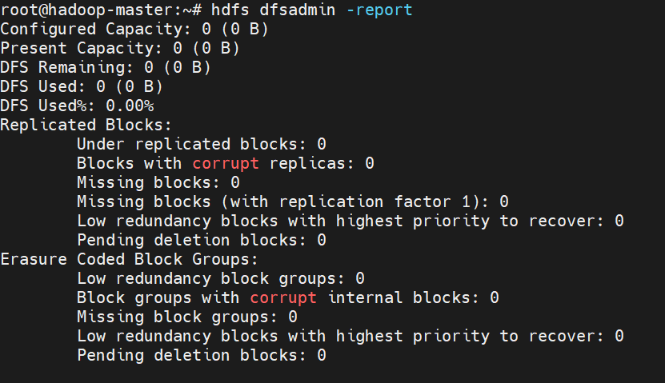

# Hadoop Traps & Pitfalls
## #1 Hadoop namenode is in safe mode

### Problem
Your Spark program stops and the error message said that HDFS files can't be written because the namenode is in safe mode. 


### Solution
Force the namenode to leave safe mode: 
```bash
# leave safe mode
hdfs dfsadmin -safemode leave
# double check
hdfs dfsadmin -safemode get
```


## #2 All datanodes are bad. Aborting

### Problem
When running the program, you got the error: `FAILED java.io.IOException: All datanodes 127.0.0.1:50010 are bad. Aborting...`


### Solution
Reduce the split size by setting the mapred.max.split.size, you can refer [here](https://stackoverflow.com/questions/27409879/hadoop-all-datanodes-127-0-0-150010-are-bad-aborting) for more info.


## #3 Cannot set priority of namenode process 

### Problem
When formatting the namenode, you got the following error:
```
start HDFS...
Starting namenodes on [hadoop-master]
hadoop-master: Warning: Permanently added '[hadoop-master]:12345,[172.18.0.2]:12345' (ECDSA) to the list of known hosts.
hadoop-master: ERROR: Cannot set priority of namenode process 381
Starting datanodes
localhost: Warning: Permanently added '[localhost]:12345' (ECDSA) to the list of known hosts.

```

### Solution
Just delete the local Hadoop and Spark tmp folders you created at the beginning and recreate them. 


## #4 java.io.EOFException: Unexpected EOF while trying to read response from server

### Problem
When running the program, you see the following message in the log:
```
22/08/12 02:00:43 WARN DataStreamer: Exception for BP-1474640038-172.18.0.2-1660264852605:blk_1073743776_2952
java.io.EOFException: Unexpected EOF while trying to read response from server
    at org.apache.hadoop.hdfs.protocolPB.PBHelperClient.vintPrefixed(PBHelperClient.java:521)
    at org.apache.hadoop.hdfs.protocol.datatransfer.PipelineAck.readFields(PipelineAck.java:213)
    at org.apache.hadoop.hdfs.DataStreamer$ResponseProcessor.run(DataStreamer.java:1137)

```

### Solution
This error indicates that one of your datanode is down. In this case, you don't have to do anything. Thanks to the fault tolerant mechanism, HDFS will take care of itself. 


## #5 java.io.EOFException: Unexpected EOF while trying to read response from server

### Problem
When running the program, you see the following message in the log:
```
22/08/12 02:00:43 WARN DataStreamer: Exception for BP-1474640038-172.18.0.2-1660264852605:blk_1073743776_2952
java.io.EOFException: Unexpected EOF while trying to read response from server
    at org.apache.hadoop.hdfs.protocolPB.PBHelperClient.vintPrefixed(PBHelperClient.java:521)
    at org.apache.hadoop.hdfs.protocol.datatransfer.PipelineAck.readFields(PipelineAck.java:213)
    at org.apache.hadoop.hdfs.DataStreamer$ResponseProcessor.run(DataStreamer.java:1137)

```

### Solution
This error indicates that one of your datanode is down. In this case, you don't have to do anything. Thanks to the fault tolerant mechanism, HDFS will take care of itself. 


## ##6 ERROR AsyncEventQueue: Listener EventLoggingListener threw an exception

### Problem
Commonly, there are two types pf AsyncEventQueue Errors. One looks like this: 
```
22/08/09 16:17:03 ERROR AsyncEventQueue: Listener EventLoggingListener threw an exception
java.io.IOException: Failed to replace a bad datanode on the existing pipeline due to no more good datanodes being available to try. (Nodes: current=[DatanodeInfoWithStorage[10.23.190.171:9866,DS-bca502e3-327f-4eba-90b9-3d76bffae7ea,DISK]], original=[DatanodeInfoWithStorage[10.23.190.171:9866,DS-bca502e3-327f-4eba-90b9-3d76bffae7ea,DISK]]). The current failed datanode replacement policy is DEFAULT, and a client may configure this via 'dfs.client.block.write.replace-datanode-on-failure.policy' in its configuration.
        at org.apache.hadoop.hdfs.DataStreamer.findNewDatanode(DataStreamer.java:1352)
        at org.apache.hadoop.hdfs.DataStreamer.addDatanode2ExistingPipeline(DataStreamer.java:1420)
        at org.apache.hadoop.hdfs.DataStreamer.handleDatanodeReplacement(DataStreamer.java:1646)
        at org.apache.hadoop.hdfs.DataStreamer.setupPipelineInternal(DataStreamer.java:1547)
        at org.apache.hadoop.hdfs.DataStreamer.setupPipelineForAppendOrRecovery(DataStreamer.java:1529)
        at org.apache.hadoop.hdfs.DataStreamer.processDatanodeOrExternalError(DataStreamer.java:1305)
        at org.apache.hadoop.hdfs.DataStreamer.run(DataStreamer.java:668)
```
The other one looks like this: 

```
22/08/12 18:13:01 ERROR AsyncEventQueue: Listener EventLoggingListener threw an exception
java.io.IOException: All datanodes [DatanodeInfoWithStorage[172.18.0.2:9866,DS-2d060174-4dbe-4a99-b74d-b1d1bcc048f1,DISK]] are bad. Aborting...
    at org.apache.hadoop.hdfs.DataStreamer.handleBadDatanode(DataStreamer.java:1609)
    at org.apache.hadoop.hdfs.DataStreamer.setupPipelineInternal(DataStreamer.java:1543)
    at org.apache.hadoop.hdfs.DataStreamer.setupPipelineForAppendOrRecovery(DataStreamer.java:1529)
    at org.apache.hadoop.hdfs.DataStreamer.processDatanodeOrExternalError(DataStreamer.java:1305)
    at org.apache.hadoop.hdfs.DataStreamer.run(DataStreamer.java:668)
```

### Solution
For error 1, add these two configurations to your hdfs_site.xml:
```
<property>
  <name>dfs.client.block.write.replace-datanode-on-failure.enable</name>
  <value>true</value>
</property>
<property>
  <name>dfs.client.block.write.replace-datanode-on-failure.policy</name>
  <value>NEVER</value>
</property>
```

For error 2, there are 2 workarounds:
- try to increase the open file limit on your system, refer to [here](https://docs.revenera.com/fnci6133/Content/helplibrary/Setting_the_Open_File_Limit__Linux_Unix_.html#:~:text=The%20default%20open%2Dfile%20limit%20is%20typically%201024)
- more datanodes by starting new slave containers  


## #7 datanode cannot connect to namenode 

### Problem
When setting up multi-node Hadoop cluster, you somehow can't connect your datanode on one machine to namenode on another machine. The ssh and ping works fine, but when you use the command `hdfs dfsadmin -report` on your namenode and you only see that the namenode is registered as datanode. Then in the data node log, you see the following error:
```
2022-08-05 01:38:46,819 WARN org.apache.hadoop.hdfs.server.datanode.DataNode: Problem connecting to server: mlp-prod-icx-108398/10.23.190.172:9000
2022-08-05 01:38:52,820 INFO org.apache.hadoop.ipc.Client: Retrying connect to server: mlp-prod-icx-108398/10.23.190.172:9000. Already tried 0 time(s); retry policy is RetryUpToMaximumCountWithFixedSleep(maxRetries=10, sleepTime=1000 MILLISECONDS)
```

### Solution
1. on your namenode, check what is listening to the port 9000, you probably see something like this


2. check the `/etc/hosts` file using vim

Make sure that the host name has a unique IP address mapping. Otherwise, the system will take the first IP address he could find for the mapping, which causes the connection problem.  

3. reformat namenode and restart hadoop


## #8 HDFS Configured Capacity is 0 

### Problem
After formatting the name node and starting HDFS, you found out that the configured capacity is 0 


### Solution
1. stop hdfs  
2. make sure that your data node and name node directory on your local machine, e.g. `/localdisk/hdfs/nn`, is empty. If not, just delete the directory and 
3. create a new one. 
4. reformat namenode 
5. restart hdfs 


## #9 Hadoop Configured Capacity too small for big data storage


### Problem
If your data is 250GB large, but the HDFS you configured within your docker container is smaller than 250GB just as the example below shows: 


### Solution
The solution is to use a mount disk as your data node directory, e.g. 
1. find a large disk on your machine and create a hdfs folder there 
```
cd /localdisk
mkdir -p hdfs/nn hdfs/dn hdfs/tmp
```

2. configure your `core-site.xml` and `hdfs-site.xml` files with the correct data node, name node and tmp paths


3. using volume mount when starting the container
```
docker run -itd \
                --net=hadoop \
                -p 8088:8088 \
                -p 8888:8888 \
                -p 8080:8080 \
                -p 9870:9870 \
                -p 9864:9864 \
                -p 4040:4040 \
                -p 18080:18080 \
                --name hadoop-master \
                --hostname hadoop-master \
                -v [YOUR_LOCAL_PROJECT_DIR]:/mnt/code \
                -v [YOUR_LOCAL_DATA_PATH]:/mnt/data \
                -v [YOUR_HADOOP_TMP_FOLDER]:/mnt/hdfs \
                recsys2021:1.0 &> /dev/null
```

4. reformat the namenode and start HDFS 