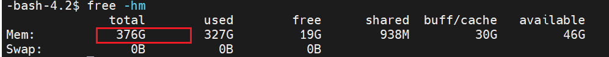

# Spark Traps & Pitfalls
## #1 java.io.IOException: no space left on device 
### Problem
Spark program stops with the following error:
> ERROR DiskBlockObjectWriter: Exception occurred while manually close the output stream to file /home/vmagent/app/dataset/spark/blockmgr-1d1af9f0-f38a-40c4-b7b5-bfedd7cfb8ae/2e/temp_shaf-3963-4c3b-b468-33b905a44e0d, No space left on device java.io.IOException: No space left on device

### Reason
This is because Spark creates some temp shuffle files under the local directory of your machine. If there is not enough space left in that directory, it will produce this error. 

### Solution
There are multiple ways to solve it. If you are using PySpark and you define the Spark configuration in your Python script, e.g. 
```bash
spark = SparkSession.builder.master('local[56]')\
       .appName("Recsys2021_data_process")\
       .config("spark.driver.memory", '500g')\
       .config("spark.local.dir", "/home/vmagent/app/dataset/spark")\
       .config("spark.sql.broadcastTimeout", "7200")\
       .config("spark.cleaner.periodicGC.interval", "15min")\
       .config("spark.executorEnv.HF_DATASETS_OFFLINE", "1")\
       .config("spark.executorEnv.TRANSFORMERS_OFFLINE", "1")\
       .config("spark.driver.extraClassPath", f"{scala_udf_jars}")\
       .config("spark.executor.extraClassPath", f"{scala_udf_jars}")\
       .config("spark.sql.adaptive.enabled", True)\
       .config("spark.driver.maxResultSize","16g")\
       .config("spark.sql.codegen.maxFields", 300)\
       .getOrCreate()
```
Then just change the `spark.local.dir` configuration to a directory with larger space. 

Otherwise, you need to edit the `spark-env.sh` or `spark-defaults.conf` and add the configuration there.  

## #2 PySpark installation
### Problem
You have installed Spark3.1.3 by manually downloading the Spark distribution and setting the SPARK_HOME variable. Then you use the "pip install pyspark==3.3.3". The PySpark version will not be upgraded.  But if you haven't configured the SPARK_HOME after downloading, the PySpark version will follow the pip install. 

### Solution
PySpark is included in the Spark distribution. So if you have downloaded Spark, there is not need to use "pip install pyspark" to install PySpark again. Furthermore, the pip installation is usually for local usage or as a client to connect to a cluster instead of setting up a cluster itself. Therefore, if you are a serious Spark user and want the full Spark functionality, please install PySpark via manually downloading the prebuilt Spark distribution instead of using pip.    


## #3 java.io.InvalidClassException: scala.collection.mutable.WrappedArray$ofRef; local class incompatible
### Problem
WARN TransportChannelHandler: Exception in connection " and "java.io.InvalidClassException: scala.collection.mutable.WrappedArray$ofRef; local class incompatible 

### Solution
WARN TransportChannelHandler: Exception in connection " and "java.io.InvalidClassException: scala.collection.mutable.WrappedArray$ofRef; local class incompatible


## #4 executor on the worker node keeps running and existing in loop 
### Problem
When running the Spark Example to calculate the Pi, you got the following error:  
```
22/08/09 03:13:15 INFO CoarseGrainedSchedulerBackend$DriverEndpoint: Asked to remove non-existent executor 1
22/08/09 03:13:15 INFO StandaloneAppClient$ClientEndpoint: Executor added: app-20220809031310-0000/2 on worker-20220809031212-10.165.9.54-39449 (10.165.9.54:39449) with 96 core(s)
22/08/09 03:13:15 INFO StandaloneSchedulerBackend: Granted executor ID app-20220809031310-0000/2 on hostPort 10.165.9.54:39449 with 96 core(s), 1024.0 MiB RAM
22/08/09 03:13:15 INFO StandaloneAppClient$ClientEndpoint: Executor updated: app-20220809031310-0000/2 is now RUNNING
22/08/09 03:13:17 INFO StandaloneAppClient$ClientEndpoint: Executor updated: app-20220809031310-0000/2 is now EXITED (Command exited with code 1)
22/08/09 03:13:17 INFO StandaloneSchedulerBackend: Executor app-20220809031310-0000/2 removed: Command exited with code 1
22/08/09 03:13:17 INFO BlockManagerMasterEndpoint: Trying to remove executor 2 from BlockManagerMaster.
22/08/09 03:13:17 INFO BlockManagerMaster: Removal of executor 2 requested
22/08/09 03:13:17 INFO CoarseGrainedSchedulerBackend$DriverEndpoint: Asked to remove non-existent executor 2
22/08/09 03:13:17 INFO StandaloneAppClient$ClientEndpoint: Executor added: app-20220809031310-0000/3 on worker-20220809031212-10.165.9.54-39449 (10.165.9.54:39449) with 96 core(s)
22/08/09 03:13:17 INFO StandaloneSchedulerBackend: Granted executor ID app-20220809031310-0000/3 on hostPort 10.165.9.54:39449 with 96 core(s), 1024.0 MiB RAM
22/08/09 03:13:17 INFO StandaloneAppClient$ClientEndpoint: Executor updated: app-20220809031310-0000/3 is now RUNNING
22/08/09 03:13:19 INFO StandaloneAppClient$ClientEndpoint: Executor updated: app-20220809031310-0000/3 is now EXITED (Command exited with code 1)
22/08/09 03:13:19 INFO StandaloneSchedulerBackend: Executor app-20220809031310-0000/3 removed: Command exited with code 1
22/08/09 03:13:19 INFO BlockManagerMaster: Removal of executor 3 requested
```

### Solution
Shut down the firewall
```
# check whether firewall is running and looking for ufw, firewalld, iptables
systemctl list-units --type=service --state=active
 
# e.g. kill the firewalld
sudo systemctl stop firewalld
```


## #6 java.lang.StackOverflowError

### Problem
```
22/08/09 15:49:38 ERROR FileFormatWriter: Aborting job a80ad884-c44b-4e7b-bd32-59a05cbd4dd0.
java.lang.StackOverflowError
    at org.codehaus.janino.CodeContext.flowAnalysis(CodeContext.java:438)
    at org.codehaus.janino.CodeContext.flowAnalysis(CodeContext.java:600)
    at org.codehaus.janino.CodeContext.flowAnalysis(CodeContext.java:600)
    at org.codehaus.janino.CodeContext.flowAnalysis(CodeContext.java:600)
    at org.codehaus.janino.CodeContext.flowAnalysis(CodeContext.java:600)
    at org.codehaus.janino.CodeContext.flowAnalysis(CodeContext.java:600)
    at org.codehaus.janino.CodeContext.flowAnalysis(CodeContext.java:600)
    at org.codehaus.janino.CodeContext.flowAnalysis(CodeContext.java:600)
    at org.codehaus.janino.CodeContext.flowAnalysis(CodeContext.java:600)
    at org.codehaus.janino.CodeContext.flowAnalysis(CodeContext.java:600)
```

### Solution
add the `spark.driver.extraJavaOptions="-Xss30M"` to your spark-defaults.conf. 


## #7 py4j.protocol.Py4JNetworkError: Answer from Java side is empty

### Problem
Your spark program stops with the following error:

```
Exception occurred during processing of request from ('127.0.0.1', 40168)
ERROR:root:Exception while sending command.
Traceback (most recent call last):
  File "/opt/spark-3.3.0-bin-hadoop3/python/lib/py4j-0.10.9.5-src.zip/py4j/clientserver.py", line 516, in send_command
    raise Py4JNetworkError("Answer from Java side is empty")
py4j.protocol.Py4JNetworkError: Answer from Java side is empty
```
### Reason
What happens here is that the Py4J, which is responsible for the communicate between python and java, cannot reach Java anymore. This is usually because the java process gets silently killed by the OOM killer. The OOM Killer (Out of Memory Killer) is a Linux process that kicks in when the system becomes critically low on memory. It selects a process based on its "badness" score and kills it to reclaim memory.

### Solution
Check whether the spark.driver.memory is set too high in your pyspark program.  This should not exceed your physical memory size. 

e.g. if you only have 376 RAM in total, you could not set the value to 500g. 

Other options you could try are:
- increase the number of partitions if you're working with very big data sources;
- increase the number of worker nodes;
- add more physical memory to worker/driver nodes;
- increase docker memory limit

as suggested in this [post](https://stackoverflow.com/questions/37252809/apache-spark-py4jerror-answer-from-java-side-is-empty). 


